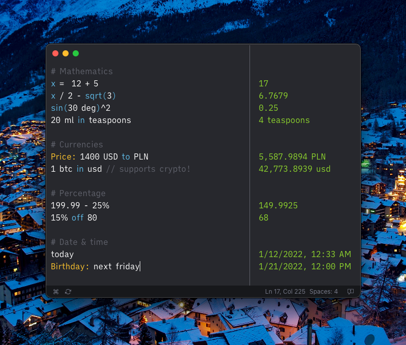

	 
	 
	
	<h1>Parsify Desktop</h1>
	

		<b>Extendable text calculator for the 21st Century :zap:</b>
	

	 
	

		<a href="https://parsify.app">💻 Website</a>
		•
		<a href="https://docs.parsify.app">📄 Documentation</a>
		•
		<a href="https://headwayapp.co/parsify-changelog">📝 Changelog</a>
	

	 
	

---

## Download

You can install Parsify Desktop for free using [GitHub Releases](https://github.com/parsify-dev/desktop/releases).

The free version is limited in functionality; more details can be found in [the documentation](https://docs.parsify.app/miscellaneous/free-vs-activated). You can buy the license from the [official site](https://parsify.app), supporting further development and unlocking additional features. 

**We offer significant discounts for students of all ages.**

## Supported platforms

- macOS 10.11+
- Windows 7+ (64-bit only)
- Linux (most distributions)

Each release is tested on the latest version of macOS, Windows, and Linux Ubuntu.

---

##### Copyright © 2019-2022 [Antoni Kępiński](https://www.kepinski.ch)
