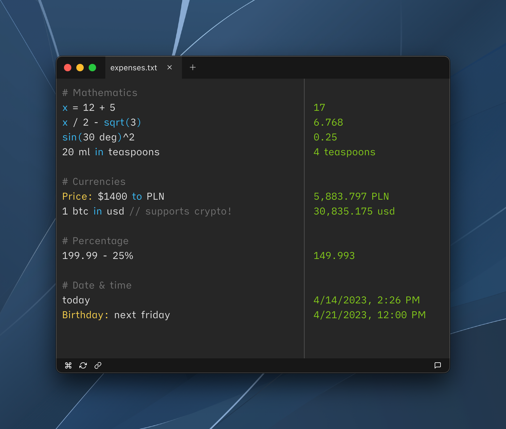

	 
	 
	
	<h1>Parsify Desktop</h1>
	

		<b>Extendable text calculator for the 21st Century :zap:</b>
	

	 
	

		<a href="https://parsify.app">💻 Website</a>
		•
		<a href="https://parsify.app">📄 Documentation</a>
		•
		<a href="https://parsify.app">📝 Changelog</a>
	

	 
	

---

## Download

You can install Parsify Desktop for free from the official website or using [GitHub Releases](https://github.com/parsify-dev/desktop/releases).

The free version is limited in functionality, more details can be found on [this page](https://docs.parsify.app/miscellaneous/free-vs-activated). You can buy the license from the official site as well, supporting further development and unlocking additional features. **We offer significant discounts for students of all  ages.**

---

##### Copyright © 2019-2022 [Antoni Kępiński](https://www.kepinski.ch)
